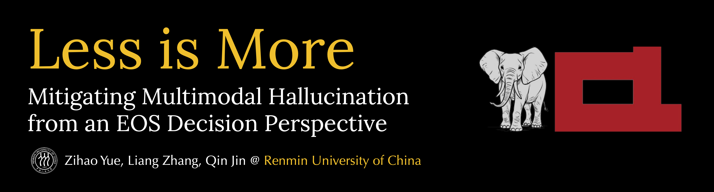

<a href="https://arxiv.org/pdf/2402.14545" class="brand-link w-nav-brand">
    
</a>

## Checklist

What you can find in this repo:

- Selective EOS Supervision
  - training code
  - trained model checkpoints
- Scoring EOS Supervision
  - data filtering code
  - filtered data
- CHAIR evaluation
  - evaluation scripts
  - our test set data
- others
  - [generated captions](./CHAIR-eval/data/Table1-results) in [Table 1](https://arxiv.org/html/2402.14545v2#S3.T1)


## Selective EOS Supervision

### Training

Following the instruction of [LLaVA](https://github.com/haotian-liu/LLaVA) to prepare the environment, data (`LLaVA-Instruction-150K`) and pretraining models (e.g., `LLaVA-1.5-7b`). 

Train the model with Selective EOS Supervision. The default configuration is set to train the `llava-1.5-7b` model with `Detail23k` for one epoch.

```bash
cd LLaVA
bash scripts/v1_5/selective_eos_finetune.sh
```
The main modifications to the original LLaVA code for Selective EOS Supervision are detailed in [./assets/selective-eos-supervision.md](./assets/selective-eos-supervision.md).

### Checkpoint

Our models (LoRA weights) finetuned with Selective EOS Supervision:

Basic Model | Finetuning Data | Checkpoint
 :- | :- | :-
`llava-1.5-7b` | `Detail23k` | [llava-v1.5-7b-selective-23k-lora](https://huggingface.co/yuezih/llava-v1.5-7b-selective-23k-lora)
`llava-1.5-7b` | `LLaVA-Instruction-150K` | [llava-v1.5-7b-selective-150k-lora](https://huggingface.co/yuezih/llava-v1.5-7b-selective-150k-lora)


## Scoring EOS Supervision

### Data Scoring

For the LLaVA codebase, due to some constraints related to deepspeed, currently I have no idea about how to efficiently score a dataset with a standalone script. Our scoring relies on the training process, i.e., for each training step:
- Score the data in the minibatch and save the scores;
- Cancel loss backward (can be achieved by modifying the trainer code).

The core code for data scoring are provided in `./LLaVA/llava/model/language_model/llava_llama_filter.py`.

### Filtered Data

Our data filtered with Scoring EOS Supervision:

Basic Data | Filtered Data
:- | :-
`LLaVA-Instruction-150K` | LLaVA-Instruction-150K-filtered [[OneDrive]](https://1drv.ms/u/c/97dec68abb271787/EdVLzADx-SVFtHL2sHyg4LEBQfY6SlyuNFY6f0_qcLPMjA?e=UWGWbF)

### Training

Instruction tune the LLaVA-7b model on our filtered data with:

```bash
cd LLaVA
bash scripts/finetune_qlora_filtered.sh
```


## CHAIR Evaluation

### Data

The test set used in our paper for CHAIR evaluation is provided in [./CHAIR-eval/data/chair-500.jsonl](./CHAIR-eval/data/chair-500.jsonl). The data is randomly sampled from the MSCOCO validation set with a random seed of 0.

For test set images, we provide a [python script](./CHAIR-eval/prepare_data.py) to collect images from the original MSCOCO images with softlinks. Please specify the path of your own MSCOCO image path. The script will create a folder `./CHAIR-eval/data/chair-500` for the CHAIR images.

```bash
python ./CHAIR-eval/prepare_data.py
```
The script also downloads the annotation files of MSCOCO detection, which will be used for CHAIR evaluation.

### Evaluation

We provide a [script](./CHAIR-eval/eval.sh) for CHAIR inference and evaluation.  
Set your model in the following script and then run it:

```bash
bash ./CHAIR-eval/eval.sh
```
The first-time evaluation can be slow because of the ground-truth object set construction. Subsequent evaluations will be faster with the cache.


## Citation

If you find this repo helpful, please consider citing our paper:

```bibtex
@misc{yue2024less,
      title={Less is More: Mitigating Multimodal Hallucination from an EOS Decision Perspective}, 
      author={Zihao Yue and Liang Zhang and Qin Jin},
      year={2024},
      eprint={2402.14545},
      archivePrefix={arXiv},
      primaryClass={cs.CL}
}
```

## Acknowledgement

This repo is built on [LLaVA](https://github.com/haotian-liu/LLaVA) (models) and [OPERA](https://github.com/shikiw/OPERA) (CHAIR evaluation). Many thanks for their efforts. The use of our code should also follow the original licenses.